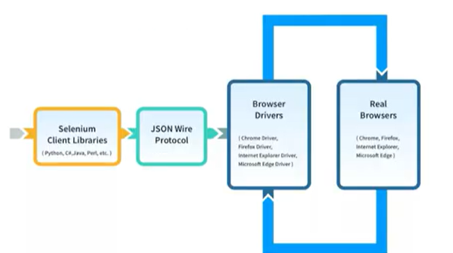

# Primeiros passos com Cypress

## O que é Cypress?

### Como surgiu o Cypress

- Ferramenta de auxílio à criação, configuração, execução e depuração de testes automatizados para aplicações modernas.
- É executado diretamente no browser, portanto é um processo servidor node, no qual temos acesso inclusive a ferramentas e ações do browser.
- Surgiu em meio à **insatisfação** de engenheiros de softwares e QAs devido às limitações do Selenium e a necessidade cada vez maior do time de QA com desenvolvedores. **Agora os devs também se importam com toda a pirâmide de testes!**

#### Selenium

- Arquitetura do Selenium
  - 
- Limitações gerais do Selenium:
  - Configuralçao para testes de acordo com o ambiente pode ser complexas.
  - Pré-condições de testes pode ser difícil configuração.
  - Não há geração automática de report.
  - Problemas com uso de espera de elementos gerando testes não-confiáveis.
  - Foco em testes E2E.

#### Cypress

- Missão:
  - Ecossistema open-source
  - Aumento de produtividade
  - Melhor experiência com testes
  - Boa documentação
  - Integração entre desenvolvedores + QA
- Público-alvo:
  - Desenvolvedores (principalmente front-ends)
  - Engenheiros de automação / QA
- Níveis de testes
  - End-to-ende
    - Performar ações via UI
  - Componentes
    - Testes em componentes front-end de bibliotecas conhecidads (React, Angular, Vue, Svelte)
  - Integração/API
    - Uso de chamadas HTTP
  - Unidade
- Funcionalidades
  - Time travel
  - Depuração
  - Espera automática
  - Spies, Stubs and Clocks
  - Controle de tráfego de rede
  - Resultados consistentes
  - Screenshots/Videos
  - Cross-browsing
  - Orquestração inteligente
  - Detecção de testes não-confiáveis

### Instalação e configuração

#### Requerimentos (Hardware)

- macOS 10.9 +
- Linux Ubuntu 12.04 | Fedora 21 | Debian 8 +
- Windows 7 +
- Node.js (14 / 16 / 18) -> usar versão LTS
- 4GB de memória RAM, no mínimo

#### Instalação

- Criar projeto -> `npm init`
- Acessar pasta do projeto
- Instalar o cypress com o seguinte commando -> `npm install cypress --save-dev`
- Executando a aplicação -> `npx cypress open`
- Adicionar o .gitignore do projeto -> dica: utilize o site [https://www.toptal.com/developers/gitignore](https://www.toptal.com/developers/gitignore) para gerar um template inicial
- Criar projeto git -> `git init`

### Executando meu primeiro teste

#### Launchpad

- Guia de decisões e configurações para iniciar projetos de testes automatizados
  - Tipos de testes a serem desenvolvidos
    - E2E
    - Components
  - Configurações rápidas de inicialização
  - Escolher um browser para executar testes de forma visual
  - Selecionar o teste para execução

- Menu para trocar de browser
- Menu de acesso à documentação
- Opção para referência da versão do cypress sendo usada
- Página de Specs
  - Opção de criação de testes
- Página de Configuração
  - Configuração de projeto
  - Configuração de dispositivo
  - Configuração para integração com o Cypress Cloud
- Página 'Runs' e 'Debug'
  - Necessária integração com o Cypress Cloud para visualizar as execuções de testes gravadas em nuvem e visualizar execuções de testes e depurar problemas ocorridos em pipeline.

### Cypress CLI

- Abrindo o App
`cypress open [options]`

- Executanto o teste sem UI
`cypress run`

  - Alguns argumentos:
    - --browser ou -b
    - --config-file ou -C
    - --env ou -e
    - --help
    - --spec
    - --tag

## Questionário

### 01 - Qual comando não existe no Cypress?

- [x] cypress config
- [ ] cypress open
- [ ] cypress run
- [ ] cypress verify
- [ ] cypress cache

### 02 - A respeito de melhores práticas

I - Devemos evitar uso de seletores facilmente mutáveis.
II - Cypress recomenda o uso de data-cy, data-test ou test-id para identifcar os elementos.
III - O cypress já possui um timeout padrão para os comandos
IV - Sempre use os seletores mais simples possíveis, mesmo que vários elementos sejam encontrado a partir deles.
V - É uma prática usar o intercept em testes com UI, pois podemos fazer asserções sobre o estado de requisições em uma situação de uso da interface e tornar os testes mais confiáveis.

- [x] I, III e V
- [ ] I, II, III e V
- [ ] III, IV e V
- [ ] I e III
- [ ] Todas estão corretas

### 03 - Sobre asserções assinale a alternativa incorreta

- [ ] As asserções são feitas sempres de forma encadeada.
- [x] Para validações implícitas podemos usar o 'except'.
- [ ] Podemos usar .should() e then() no auxílio de validações mais complexas.
- [ ] É possível encadearmos para vários comandos .should().
- [ ] As asserções podem ser do tipo Chai, Chain-jQuery e Chai-Sinon, fornecendo uma gama de opções para os testes.

### 04 - Assinale a sentença verdadeira quando a diferenças entre Cypress e Selenium

- [x] Não podemos afirmar que o Cypress é melhor ou pior que o Selenium. Tudo depende do contexto de uso e da estratégia de automação.
- [ ] o Cypress possui muito mais vantagens que o Selenium, explicando porque o mercado está preferindo seu uso.
- [ ] O Cypress não exige conhecimento de programação, enquanto o Selenium exige grande conhecimento em Java.
- [ ] O Cypress foi feito para desenvolvedores enquanto o Selenium é feito para QAs.
- [ ] O Selenium é mais antigo que o Cypress, portanto ele é mais robusto e possui mais features.

### 05 - Em que situação um alias não se torna necessário

- [x] Para fazer asserções específicas a respeito de um elemento repassado pelo .get().
- [ ] Para compartilhar contexto em uma suíte de testes.
- [ ] Para auxíliar na validação de requisitos em testes de API.
- [ ] Para retomar requisições que foram interceptadas durante o teste.
- [ ] Para retomar elementos de forma a substituir o uso de variáveis.

### 06 - Quais tipos de testes o Cypress não viabiliza de forma padrão, ou seja, sem adições de plugins?

- [x] Teste de performance
- [ ] Teste de unidade
- [ ] Teste de integração
- [ ] Teste E2E
- [ ] Teste de componentes

### 07 - Sobre a interface gráfica verifique quais alternativas são verdadeiras

I - A abertura do Cypress App permite que a configuração inicial do projeto seja feita.
II - É possível rodar cypress com vários browsers simultaneamente pela UI.
III - Ao iniciarmos o App, o cypress pergunta se queremos configurar testes de unidade, compoenente ou E2E.
IV - A interface gráfica permite que acessemos o DevTools do browser.
V - É viável utilizar a UI do Cypress em todas as situações, pois ele é mais fácil de usar.

- [ ] I, II e V
- [x] I e IV
- [ ] I, II e IV
- [ ] II e IV
- [ ] Todas estão incorretas

### 08 - Avalie as seguintes sentenças

I - Cypress possui integrado jQuery, uma API que retorna os elementos procurados na página.
II -  A única forma de localizar os elementos da página com Cypress é através do CSS Selectors.
III -  Devido à sua natureza assíncrona, os comandos do cypress não retornam objetos, mas repassam os elementos para outro comando encadeado.
IV - Os comandos possuem validações padrão, não sendo necessário uso de um 'assert' em todo comando.
V-  É possível fazer validações de forma implícita e explícita.

- [x F F V V V
- [ ] V F V V V
- [ ] F F V F V
- [ ] F V V F V
- [ ] V V V V V

### 09 - Com Cypress nós não podemos?

- [ ] Executar testes
- [ ] Configurar testes
- [x] Escrever testes em outras linguagens diferentes de JavaScript
- [ ] Escrever testes em JavaScript
- [ ] Depurar testes.
